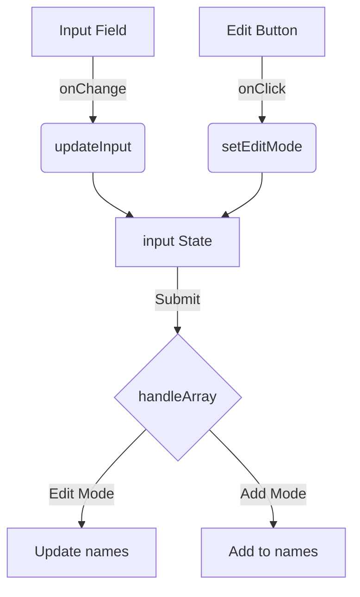

# 🚀 شرح تفصيلي لإدارة الأسماء باستخدام React | useState | array

## 🌟 المفاهيم الأساسية

### 1. useState: قلب إدارة الحالة
- **ما هو؟**: دالة في React تتيح إدارة الحالة داخل المكونات الوظيفية.
- **كيف يعمل؟**:
  ```jsx
  const [state, setState] = useState(initialValue);
  ```
  - `state`: القيمة الحالية للحالة
  - `setState`: دالة لتحديث الحالة
  - `initialValue`: القيمة الابتدائية

### 2. تدفق البيانات
- **أحادي الاتجاه**: تمرير البيانات من المكونات العليا إلى الأدنى
- **التحديثات**: تتم عبر دوال تحديث الحالة (setState) فقط

## 🛠️ شرح تفصيلي للكود

### 1. تهيئة الحالات
```jsx
const [names, setNames] = useState(["محمد", "محمد", "محمد", "محمد", "محمد"]);
const [input, setInput] = useState("");
const [editIndex, setEditIndex] = useState(null);
```

| الحالة       | الغرض                           | النوع   |
|--------------|----------------------------------|---------|
| `names`      | تخزين قائمة الأسماء             | Array   |
| `input`      | تتبع قيمة حقل الإدخال           | String  |
| `editIndex`  | تحديد العنصر قيد التعديل        | Number  |

### 2. معالجة الإضافة والتعديل
```jsx
function handleArray() {
  if (input.trim()) {
    if (editIndex !== null) {
      // تحديث الاسم
      setNames(prev => prev.map((name, i) => 
        i === editIndex ? input : name
      ));
      setEditIndex(null);
    } else {
      // إضافة اسم جديد
      setNames(prev => [...prev, input]);
    }
    setInput("");
  }
}
```

| السيناريو     | الإجراء                      |
|---------------|------------------------------|
| التعديل       | تحديث العنصر المحدد         |
| الإضافة       | إلحاق اسم جديد للمصفوفة     |

### 3. حذف العناصر
```jsx
const handleDelete = (index) => {
  setNames(prev => prev.filter((_, i) => i !== index));
}
```


### 4. بدء التعديل
```jsx
const handleEdit = (index) => {
  setInput(names[index]);
  setEditIndex(index);
}
```

## 📊 تدفق البيانات بين المكونات



## 💡 أفضل الممارسات

1. **المفاتيح الفريدة (Keys)**
   ```jsx
   {names.map((name, index) => (
     <li key={index}>...</li>
   ))}
   ```
   - ضروري لتحسين الأداء
   - تجنب استخدام الفهرس إذا كانت البيانات ديناميكية

2. **التحديث الآمن للحالة**
   ```jsx
   // صحيح
   setNames(prev => [...prev, newName]);
   
   // خاطئ
   names.push(newName);
   setNames(names);
   ```

3. **التحقق من القيم الفارغة**
   ```jsx
   if (input.trim() !== "") {
     // تنفيذ العمليات
   }
   ```

## 🔄 دورة حياة التحديثات

1. المستخدم يضغط على "تعديل"
2. تحديث حالة `input` و`editIndex`
3. إدخال القيمة الجديدة
4. الضغط على "تحديث"
5. تنفيذ `handleArray`
6. تحديث حالة `names`
7. إعادة التصيير (Re-render)

## 🎨 تصميم الواجهة مع Tailwind CSS

### هيكل رئيسي
```jsx
<div className="flex flex-col items-center min-h-screen bg-gray-100 p-6">
  <div className="w-full max-w-md bg-white rounded-lg shadow p-6">
    {/* المحتوى */}
  </div>
</div>
```

### مزايا التصميم:
- **استجابة**: `max-w-md` يحدد العرض الأقصى
- **التظليل**: `shadow` لإضافة عمق
- **التنسيق**: `rounded-lg` لزوايا مدورة

## 🧪 اختبار الوظائف الرئيسية

| الوظيفة       | الإدخال           | الناتج المتوقع                 |
|---------------|-------------------|---------------------------------|
| handleAdd     | "أحمد"            | إضافة "أحمد" للقائمة           |
| handleEdit    | ضغط على تعديل     | ملء الحقل بالقيمة المحددة      |
| handleUpdate  | "علي" أثناء التعديل | تحديث العنصر المحدد إلى "علي"  |
| handleDelete  | ضغط على حذف       | إزالة العنصر من القائمة        |

