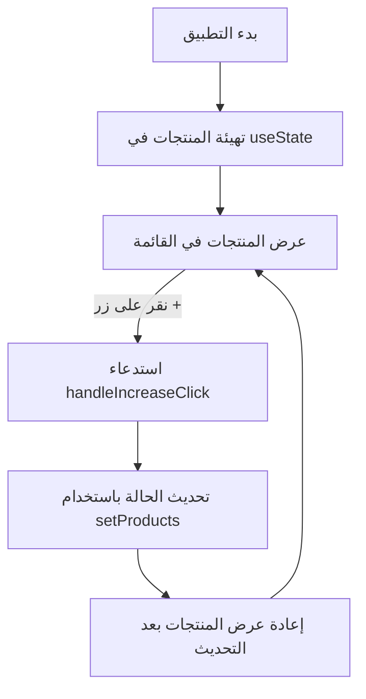

### **شرح الحل للتحدي**

هذا الكود يمثل **مكون React** يقوم بإدارة وعرض سلة التسوق، مع إمكانية **زيادة عدد المنتجات** عند النقر على زر `+`.

---

## **1. التهيئة باستخدام `useState`**
```jsx
const [products, setProducts] = useState(initialProducts);
```
يتم تخزين قائمة المنتجات في **حالة (state)**، مما يسمح بتحديثها عند التفاعل مع الواجهة.

---

## **2. وظيفة `handleIncreaseClick`**
```jsx
function handleIncreaseClick(productId) {
  setProducts(
    products.map((product) => {
      if (product.id === productId) {
        return {
          ...product,
          count: product.count + 1,
        };
      }
      return product;
    })
  );
}
```
### **التفسير:**
1. تستخدم `setProducts` لتحديث الحالة (`products`).
2. يتم استخدام `map()` لإنشاء **نسخة جديدة** من المنتجات.
3. إذا كان `product.id` يساوي `productId`، يتم **زيادة `count` بمقدار 1**.
4. يتم إرجاع المنتج كما هو إذا لم يتطابق `id`.

---

## **3. عرض سلة التسوق**
```jsx
<ul>
  {products.map((product) => (
    <li key={product.id}>
      {product.name} (<b>{product.count}</b>)
      <button onClick={() => handleIncreaseClick(product.id)}>+</button>
    </li>
  ))}
</ul>
```
- **يتم عرض اسم المنتج وعدده (`count`)**.
- **عند النقر على زر `+` يتم استدعاء `handleIncreaseClick(product.id)`**.
- **يتم تحديث الواجهة تلقائيًا عند تحديث الحالة (`products`)**.

---

## **4. مخطط تدفق العملية**


---

## **5. التحسينات الممكنة**
🚀 **إضافة زر `-` لإنقاص العدد مع التأكد من عدم نزوله إلى أقل من `1`**.  
🚀 **إضافة زر لحذف المنتج بالكامل عند وصول `count` إلى `0`**.  
🚀 **حفظ حالة السلة في `localStorage` حتى لا تضيع عند إعادة تحميل الصفحة**.  

---

### **🎯 النتيجة النهائية**
✅ **تحديث ديناميكي للعدد عند النقر على `+`**.  
✅ **واجهة مستخدم متجاوبة باستخدام `useState`**.  
✅ **استخدام `map()` لضمان عدم التعديل المباشر على الحالة**.  
✅ **تحسين تجربة المستخدم من خلال تحديث الواجهة تلقائيًا**.