## **شرح تفصيلي للكود وآلية عمل البرنامج**  

### **نظرة عامة**  
الكود يمثل **عربة تسوق تفاعلية** باستخدام **React**، حيث يمكن للمستخدم:  
✅ **زيادة** عدد العناصر في العربة.  
✅ **إنقاص** عدد العناصر مع منع العدد من أن يكون أقل من **1**.  
✅ **حذف عنصر** مع التأكد من أن المستخدم أدخل اسم العنصر الصحيح.  

يستخدم الكود **`useState`** لإدارة حالة المنتجات في العربة، ويتعامل مع تحديثات الحالة عند تعديل عدد المنتجات أو حذفها.  

---

## **تحليل مكونات الكود**  

### **١- تعريف البيانات الأولية (`initialProducts`)**  
```jsx
const initialProducts = [
  { id: 0, name: "Baklava", count: 1 },
  { id: 1, name: "Cheese", count: 5 },
  { id: 2, name: "Spaghetti", count: 2 },
];
```
هذه المصفوفة تحتوي على قائمة بالمنتجات المتاحة في العربة، مع **`id`** (معرّف المنتج)، **`name`** (اسم المنتج)، و**`count`** (عدد الوحدات).  

---

### **٢- تعريف حالة العربة (`useState`)**  
```jsx
const [products, setProducts] = useState(initialProducts);
```
- يتم استخدام **`useState`** لتخزين قائمة المنتجات وإعادة تحديثها عند التعديل على العربة.  
- القيمة الأولية هي **`initialProducts`**.  

---

## **تحليل الدوال الوظيفية**  

### **١- دالة زيادة العدد (`handleIncreaseClick`)**  
```jsx
function handleIncreaseClick(productId) {
  setProducts(
    products.map((product) => {
      if (product.id === productId) {
        return { ...product, count: product.count + 1 };
      }
      return product;
    })
  );
}
```
🔹 **آلية العمل:**  
- تستخدم **`map`** للمرور على جميع المنتجات.  
- إذا كان **`product.id === productId`**، يتم **زيادة العدد بمقدار 1**.  
- يتم إنشاء **نسخة جديدة** من العنصر لضمان تحديث الحالة بشكل صحيح.  

---

### **٢- دالة تقليل العدد (`handleDecreaseClick`)**  
```jsx
function handleDecreaseClick(productId) {
  setProducts(
    products.map((product) => {
      if (product.id === productId) {
        if (product.count === 1) {
          alert("Count can not be less than 1");
          return product;
        }
        return { ...product, count: product.count - 1 };
      }
      return product;
    })
  );
}
```
🔹 **آلية العمل:**  
- إذا كان **`product.id === productId`**، يتم تقليل العدد بمقدار 1.  
- **يمنع العدد من أن يصبح أقل من `1`**، وإذا حاول المستخدم إنقاص العدد عند `1`، يظهر **تحذير** (`alert`).  

---

### **٣- دالة الحذف (`handleDeleteClick`)**  
```jsx
function handleDeleteClick(productId) {
  const productToDelete = products.find((product) => product.id === productId);
  if (!productToDelete) return;

  const ConfirmedProductName = window.prompt(
    `Enter the name of the product (${productToDelete.name}) to confirm deletion:`
  );
  
  if (!ConfirmedProductName) return;
  if (ConfirmedProductName !== productToDelete.name) {
    alert("Product name does not match!");
    return;
  }

  setProducts(products.filter((product) => product.id !== productId));
}
```
🔹 **آلية العمل:**  
1. يتم **البحث عن المنتج** الذي ضغط عليه المستخدم.  
2. **يطلب من المستخدم** إدخال اسم المنتج **للتأكيد**.  
3. **إذا لم يكتب المستخدم أي شيء** → يتم إلغاء العملية.  
4. **إذا أدخل اسمًا غير صحيح** → يظهر تحذير **("Product name does not match!")** ولا يتم الحذف.  
5. **إذا كان الاسم صحيحًا** → يتم **حذف المنتج** من القائمة باستخدام `filter`.  

---

## **٤- بناء واجهة المستخدم (`return`)**  
```jsx
return (
  <div className="max-w-md mx-auto mt-10 p-4 bg-white shadow-md rounded-md">
    <h2 className="text-xl font-bold mb-4">Shopping Cart</h2>
    <ul className="space-y-5">
      {products.map((product) => (
        <li key={product.id} className="flex justify-between items-center p-2 border rounded">
          <button onClick={() => handleDecreaseClick(product.id)}
            className="px-3 py-1 bg-red-500 text-white rounded hover:bg-red-600 transition">
            -
          </button>
          <span className="text-lg">{product.name} (<b>{product.count}</b>)</span>
          <button onClick={() => handleIncreaseClick(product.id)}
            className="px-3 py-1 bg-blue-500 text-white rounded hover:bg-blue-600 transition">
            +
          </button>
          <button onClick={() => handleDeleteClick(product.id)}
            className="px-3 py-1 bg-green-500 text-white rounded hover:bg-green-600 transition">
            Delete
          </button>
        </li>
      ))}
    </ul>
  </div>
);
```
🔹 **الهيكل العام للواجهة:**  
✅ **عنوان** عربة التسوق.  
✅ **قائمة المنتجات** مع عرض الاسم والعدد الحالي.  
✅ **زر `+` لزيادة العدد، زر `-` لإنقاصه، وزر `Delete` للحذف**.  

---

## **تدفق عمل الدوال وآلية تشغيل البرنامج**  

```mermaid
graph TD;
  Start --> DisplayCart
  DisplayCart -->|User Clicks &#43;| IncreaseCount
  IncreaseCount --> UpdateState
  UpdateState --> DisplayCart

  DisplayCart -->|User Clicks &#45; | DecreaseCount
  DecreaseCount --> CheckMinValue
  CheckMinValue -->|Count > 1| UpdateState
  CheckMinValue -->|Count = 1| ShowWarning
  ShowWarning -->|Alert User| DisplayCart

  DisplayCart -->|User Clicks Delete| ConfirmDeletion
  ConfirmDeletion -->|User Enters Product Name| ValidateName
  ValidateName -->|Name Matches| RemoveItem
  ValidateName -->|Name Does Not Match| ShowError
  ShowError -->|Alert User| DisplayCart
  RemoveItem -->|Alert Deleted| UpdateState
  UpdateState --> DisplayCart
```



---

## **آلية عمل البرنامج في حال نجاح أو فشل العمليات**  

### **📌 في حال زيادة العدد**
1. المستخدم يضغط على **زر `+`**.
2. يتم استدعاء **`handleIncreaseClick`**.
3. يتم تحديث عدد المنتج في `useState`.
4. يتم إعادة تحديث الواجهة وإظهار العدد الجديد.  

---

### **📌 في حال تقليل العدد**
1. المستخدم يضغط على **زر `-`**.
2. يتم استدعاء **`handleDecreaseClick`**.
3. إذا كان العدد أكبر من `1` → يتم تقليله.  
4. إذا كان العدد `1` → يظهر **تحذير**.  

---

### **📌 في حال حذف منتج**
1. المستخدم يضغط على **زر `Delete`**.
2. يتم استدعاء **`handleDeleteClick`**.
3. يتم طلب **تأكيد الحذف عبر إدخال اسم المنتج**.  
4. إذا كان الاسم **صحيحًا** → يتم حذف المنتج.  
5. إذا كان الاسم **خاطئًا** → يظهر **تحذير** ويتم إلغاء العملية.  

---

## **💡 الخلاصة**
- البرنامج **يحافظ على البيانات** باستخدام `useState` ويقوم بتحديث الواجهة تلقائيًا.  
- يتم **منع حذف منتج خاطئ** عبر التأكد من إدخال الاسم الصحيح.  
- **واجهة المستخدم تفاعلية وسهلة الاستخدام**، مع رسائل تنبيهية عند الحاجة.  

**🎯 جاهز للعمل الآن! 🚀🔥**